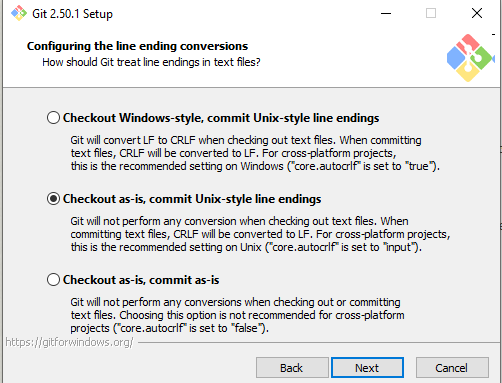
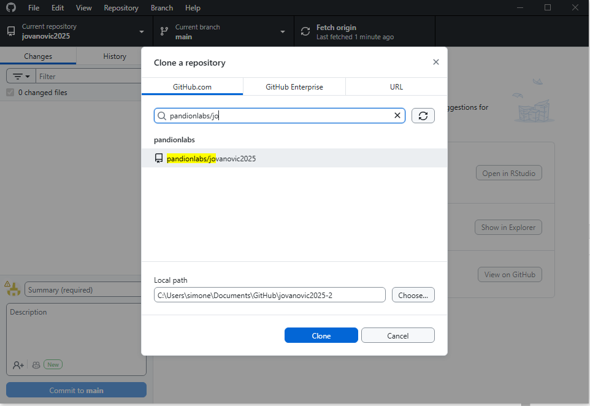

# Outline

This document will guide to make changes to your code following best practices, after your code has been updated by Pandion Labs.

1. Install IDE
2. Git & Github
3. First time setup
4. Make the a change
5. Publish the change
6. Additional resources

After following this document you will be a pro in doing R development using the latest best practices.

## Why

Why do I have to go through all this trouble?

# 1. Install IDE

In order to properly edit your code you need to use an IDE (Integrated Development Environment). There are many options available, for R development those are the two top options:

- Position (recommended)
- RStudio (legacy)

We suggest using Positron as it is the modern IDE with better features, but if you are used to RStudio it also works perfectly well.
Both of those editors are maintained by [Posit](https://posit.co/) (formerly RStudio), ensuring that they work well with R

## Install R

- the suggested way to install R is to use [rig](https://github.com/r-lib/rig), as it is a modern way to install R and manage multiple versions
- you need to first install rig, follow the [instructions](https://github.com/r-lib/rig?tab=readme-ov-file#%EF%B8%8F-installing-rig-) for your operating system
   - on windows if you are using the installer method, windows doesn't recognise the installer as safe. Rig can be totally trusted, so when you run it you should click on "more info" and then "run anyway"

::: {.panel-tabset group="ide"}

## Positron

- Go to [https://positron.posit.co/download.html](https://positron.posit.co/download.html) to download positron for your operating system
  - on windows if you have admin rights on your machine you can select the "system level install" other download "user level install"
- Follow the instructions to install positron
- In case of issues you can check the [Positron documentation](https://positron.posit.co/troubleshooting.html)
- install R, in the terminal (a tab at the bottom section of your IDE) type `rig install`

## RStudio

- open the terminal app (on windows is `powershell`) and type `rig install`
- Go to [https://posit.co/download/rstudio-desktop/](https://posit.co/download/rstudio-desktop/)
- Ignore the step 1: Install R and directly go to step 2: Install RStudio
- Follow the instructions to install RStudio
- In case of issues you can check the [RStudio documentation](https://docs.posit.co/ide/user/)

:::


# 2. Git & Github

## Why Git

Git is a program that helps you track changes of your code versions and allow you to collaborate with others (like Pandion Labs) or colleagues.
It takes a bit to setup but it is going to be worth it.

### First concepts

Developers have a weird culture and they like to use weird a cryptic word, but thigs are not that hard. Here you have a reference to translate gitspeech into normal speech:

- **Repository** this is a "folder" where your store code
- **Git vs Github** git is the program that runs on your computer and helps you keep track of your code versions, github is a website where you can store your code and collaborate with others.

## Create a Github account

- Go to [https://github.com/join](https://github.com/join)
- Create an account and follow the instructions. Here are some [tips on how to choose your username](https://happygitwithr.com/github-acct#username-advice)
- **send username to Pandion Labs**, so that you can be added to your repository

## Install Git on your computer

Another program you need to install! (spoiler this is actually the last one in this guide)

::: {.panel-tabset}

### Windows

- install [Github Desktop](https://desktop.github.com/)
- login with your github account

OLD Instructions Simones doesn't want to delete, but are useless now

- Go to [https://git-scm.com/downloads](https://git-scm.com/downloads)
- Download git for your machine and run the installer
- make sure to select `Checkout as-is, commit Unix-style line endings` during the installation process

- for the rest make sure to use the default settings

### Linux

- use your package manager (i.e. `apt-get install git` or `dnf install git`)
- install Git credential manager, it's pretty important to keep your sanity later to manage authentication with GitHub.
  - [set the credential store](https://github.com/git-ecosystem/git-credential-manager/blob/release/docs/credstores.md#freedesktoporg-secret-service-api) by running
  ```bash
  git config --global credential.credentialStore secretservice
  ```
  - install `.NET` on your machine, use [this guide](https://learn.microsoft.com/en-us/dotnet/core/install/linux)
  - run in a terminal
  ```bash
  dotnet tool install -g git-credential-manager
  git-credential-manager configure
  ```
  to install git credential manager.


For additional details see the [official documentation](https://github.com/git-ecosystem/git-credential-manager/blob/release/docs/install.md#net-tool)


### MacOS

Talk with Sam, he really likes to be contacted on WhatsApp

I guess he will make you install github desktop as well

:::

## Get your code

Now you need to clone (gitspeech for download) your repository (remember gitspeech for folder) into your computer. Is important you use a new folder so that you have everything properly configured.

 1. Open Github Desktop
 2. `File -> Clone Repository`
 3. search for your repository name
 4. select the folder in your computer where you want to download your repository
 5. click clone



# 3. First time setup

Congratulations! You have made it thought the difficult part, now everything will take place inside your IDE.
Talking of which open your favorite IDE (either Positron or RStudio).

For the first time you setup your package you need to install the dependencies.


## Familiarize yourself with the IDE

This is time to take a break and learn the basics of your IDE, here are our suggestions of what you have to know

::: {.panel-tabset group="ide"}

### Positron

- check the layout [https://positron.posit.co/layout.html](https://positron.posit.co/layout.html)
  - make sure you know how to nagivate between files and folders
  - understand the difference between the `console` and the `terminal`
- keyboard shortcuts [https://positron.posit.co/keyboard-shortcuts.html#global-shortcuts](https://positron.posit.co/keyboard-shortcuts.html#global-shortcuts)
- [data explorer](https://positron.posit.co/data-explorer.html)
- [variables pane](https://positron.posit.co/variables-pane.html)
- [help pane](https://positron.posit.co/help-pane.html)

### RStudio

- layout [https://docs.posit.co/ide/user/ide/guide/ui/ui-panes.html](https://docs.posit.co/ide/user/ide/guide/ui/ui-panes.html)

:::

## Open project

You want to open the folder that you cloned using github desktop in the IDE

::: {.panel-tabset group="ide"}

### Positron

press `Ctrl + Shift + P` and search for `File: Open Folder` and select the folder you cloned

### RStudio

go on `File -> New Project -> Existing Directory` and select the folder you cloned

:::

## Install dependencies

::: {.callout-tip collapse="true"}
### No session in Positron

if in positron you don't see any session, press `Ctrl + Shift + P` and search for `R: Select Interpreter` to set your R interpreter.
Then it should start a new session.
:::

Go in the `console` on the top section (this is your friend are you will run a lot of your code there) and if everything worked you should see a prompt like this:

```
Type 'demo()' for some demos, 'help()' for on-line help, or
'help.start()' for an HTML browser interface to help.
Type 'q()' to quit R.

>
```

then run

```r
renv::restore()
```

this will install all of your dependencies, it may take a few minutes.

# 4. Make a change

You can now start developing your project and start making changes.

## Code Structure

The code you will be working on is an R package. R packages follow a specific structure and conventions that help organize your code, data, documentation, and tests neatly.

Here is the typical structure you will see:

```
.
├── DESCRIPTION         # Metadata about the package like name, version, authors
├── LICENSE             # License information
├── NAMESPACE           # Controls which functions are exposed in the package API
├── README.md           # Basic info and instructions, good for quick reference
├── R                  # This folder contains the main R code files defining functions
│   ├── data.R          
│   ├── functions.R      
│   └── utils.R        
├── data                 # Data files included in the package (e.g. data.csv)
│   └── data.csv        
├── man                  # Documentation files auto-generated for package functions
│   ├── data.Rd         
│   └── functions.Rd    
└── tests                # Automated tests to ensure your code works as expected
    ├── test-data.R
    └── test-functions.R
```

### What you will mainly work with

- **R folder:** This is where you add or modify R scripts containing functions or logic for the package.
- **tests folder:** Here you can add or update unit tests after making changes, to verify your code behaves correctly.
- **DESCRIPTION and NAMESPACE:** Usually, you don't need to change these unless adding new dependencies or exporting new functions.
- **man folder:** Documentation files are often generated automatically when documented properly in the R code itself.
- **data folder:** Contains any example or internal datasets used by the package.

Understanding this structure helps you focus on editing the right files during your development and testing processes.


**Every time**

# Additional resources

- [https://happygitwithr.com](https://happygitwithr.com)
- [https://peerj.com/preprints/3159.pdf](https://peerj.com/preprints/3159.pdf)
